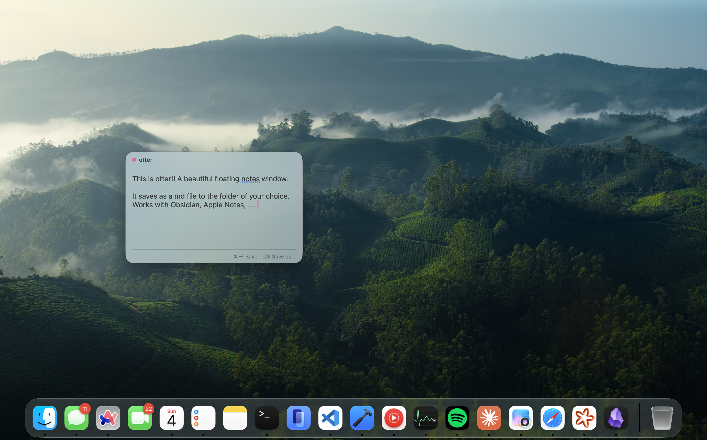
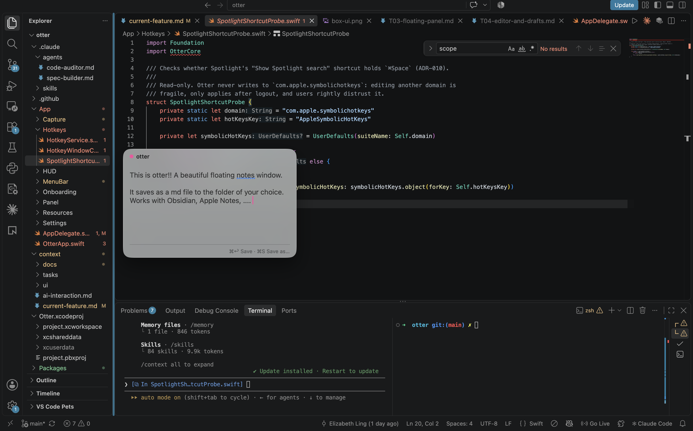

# otter

 otter is a FOS macOS menu-bar utility for capturing notes. what quick notes should've been. press a hotkey from anywhere, a small floating panel appears, type, hit `⌘↩`, and the note is filed into the notes system of your choice

 currently, there is support for Obsidian and plain folders. Apple Notes is planned for after the first release

Otter is NOT a notes app.
No account. No backend. Your data stays on your Mac by default.

## docs

| Doc | What's in it |
|---|---|
| [context/docs/OVERVIEW.md](context/docs/OVERVIEW.md) | Problem, principles, scope, non-goals, success criteria, milestones, open questions |
| [context/docs/UX_SPEC.md](context/docs/UX_SPEC.md) | Panel anatomy, states, keyboard map, menu bar, settings, first run |
| [context/docs/ARCHITECTURE.md](context/docs/ARCHITECTURE.md) | Components, data flow, capture pipeline, destinations, permissions, storage, performance budget |
| [context/docs/DECISIONS.md](context/docs/DECISIONS.md) | Architecture decision records (why Swift, why files, why not the App Store, etc.) |
| [context/tasks/README.md](context/tasks/README.md) | Build plan: milestones, dependency graph, task conventions |

## build tasks

| # | Task | Milestone |
|---|---|---|
| T01 | [Project scaffold](context/tasks/T01-project-scaffold.md) | M0 |
| T02 | [Global hotkey](context/tasks/T02-global-hotkey.md) | M0 |
| T03 | [Floating capture panel](context/tasks/T03-floating-panel.md) | M0 |
| T04 | [Editor, keyboard map, draft autosave](context/tasks/T04-editor-and-drafts.md) | M0 |
| T05 | [Capture pipeline and outbox](context/tasks/T05-capture-pipeline-outbox.md) | M0 |
| T06 | [Folder destination](context/tasks/T06-folder-destination.md) | M0 |
| T07 | [Obsidian destination](context/tasks/T07-obsidian-destination.md) | M1 |
| T08 | [Apple Notes destination](context/tasks/T08-apple-notes-destination.md) | M3 (after v1) |
| T09 | [Paste handling and attachments](context/tasks/T09-paste-and-attachments.md) | M1 |
| T10 | [Settings and first-run onboarding](context/tasks/T10-settings-and-onboarding.md) | M2 |
| T11 | [Save-clipboard hotkey and HUD](context/tasks/T11-clipboard-capture-hud.md) | M1 |
| T12 | [Menu bar item, recents, launch at login](context/tasks/T12-menubar-and-lifecycle.md) | M2 |
| T13 | [Packaging, notarization, updates](context/tasks/T13-packaging-and-distribution.md) | M2 |
| T14 | [Performance and reliability hardening](context/tasks/T14-performance-and-reliability.md) | M2 |
