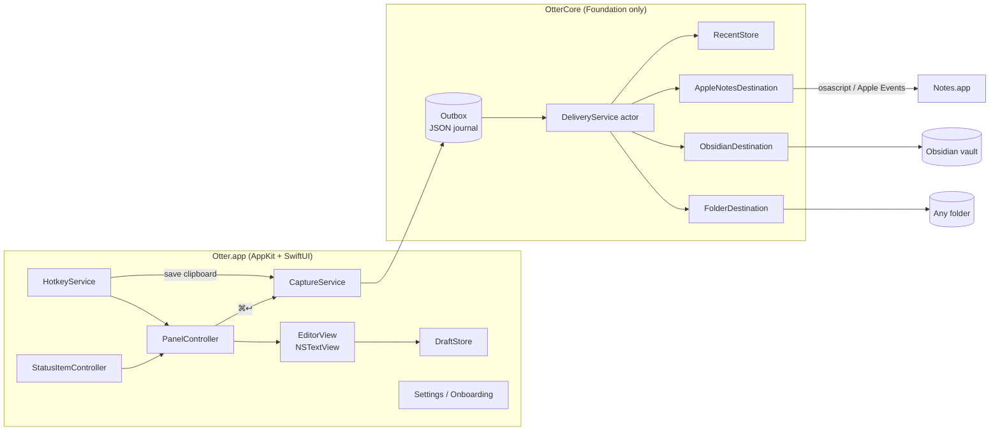
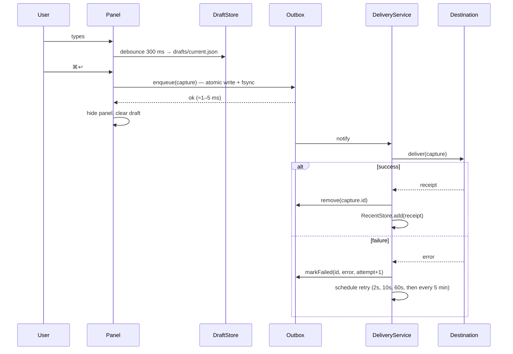

# Otter — Architecture

## 1. Shape of the system

One process. A native Swift menu-bar agent (`LSUIElement = YES`) with no server, no helper daemons, and no network access. Two modules:

- **OtterCore** (local Swift package, Foundation only, no AppKit/SwiftUI): models, outbox, delivery, Markdown/HTML formatting, destination writers, Obsidian config parsing. Fully unit-testable on the command line.
- **Otter** (app target, AppKit + SwiftUI): hotkeys, floating panel, editor, menu bar, settings, onboarding, HUD.



## 2. Source layout

```
Otter/
├── Otter.xcodeproj
├── App/
│   ├── OtterApp.swift            # @main, NSApplicationDelegateAdaptor
│   ├── AppDelegate.swift         # wiring, lifecycle
│   ├── Hotkeys/HotkeyService.swift, SpotlightShortcutProbe.swift
│   │          HotkeyWindowController.swift   # temporary recorder window until T10
│   ├── Panel/CapturePanel.swift  # NSPanel subclass
│   ├── Panel/PanelController.swift
│   ├── Panel/EditorView.swift    # NSTextView wrapper + key handling
│   ├── Panel/AttachmentChips.swift
│   ├── HUD/HUDController.swift
│   ├── MenuBar/StatusItemController.swift
│   ├── Settings/…                # SwiftUI views
│   ├── Onboarding/…
│   └── Resources/Info.plist, Assets.xcassets
└── Packages/OtterCore/
    ├── Sources/OtterCore/
    │   ├── Model/Capture.swift, Attachment.swift, DestinationConfig.swift
    │   ├── Pipeline/Outbox.swift, DeliveryService.swift, RecentStore.swift, DraftStore.swift
    │   ├── Destinations/Destination.swift
    │   ├── Destinations/Folder/FolderDestination.swift, MarkdownWriter.swift, FileNamer.swift
    │   ├── Destinations/Obsidian/ObsidianDestination.swift, VaultDiscovery.swift,
    │   │                         DailyNoteResolver.swift, MomentFormat.swift
    │   ├── Destinations/AppleNotes/AppleNotesDestination.swift, NotesHTML.swift, OsascriptRunner.swift
    │   ├── Hotkeys/HotkeyCombo.swift, SpotlightShortcutState.swift, EffectiveToggleHotkey.swift,
    │   │           PanelToggleAction.swift, ShortcutValidation.swift   # pure hotkey rules (T02)
    │   └── Support/Logging.swift     # Logger categories (§10), shared by app and core
    │               Signposts.swift   # os_signpost intervals (§9)
    └── Tests/OtterCoreTests/
```

## 3. Core model

```swift
public struct Capture: Codable, Identifiable, Sendable {
    public let id: UUID
    public let createdAt: Date          // stored with the local TZ offset at capture time
    public var text: String
    public var attachments: [Attachment]
    public var destinationID: DestinationID
    public var source: Source           // .panel | .clipboard
}

public struct Attachment: Codable, Sendable {
    public let id: UUID
    public var originalName: String?
    public var uti: String              // e.g. public.png
    public var relativePath: String     // inside outbox/<capture-id>/files/
    public var byteCount: Int
}

public protocol Destination: Sendable {
    var id: DestinationID { get }
    var displayName: String { get }
    var supportsAttachments: Bool { get }
    func healthCheck() async -> DestinationHealth          // .ok | .needsPermission | .unreachable(String)
    func deliver(_ capture: Capture, files: URL) async throws -> DeliveryReceipt
}

public struct DeliveryReceipt: Codable, Sendable {
    public var location: Location        // .file(URL) | .obsidian(vault: String, path: String) | .appleNote(id: String?)
    public var deliveredAt: Date
}
```

`DestinationConfig` is a Codable enum (`.folder(FolderOptions)`, `.obsidian(ObsidianOptions)`, `.appleNotes(NotesOptions)`) persisted in `UserDefaults` as JSON. Folder locations are stored as **bookmark data**, not paths, so moved/renamed folders keep working.

## 4. The capture pipeline

The pipeline is the heart of the "instant and never lose anything" promise.



**Rules**

1. The panel hides only after the outbox write returns. That write is a small local file — single-digit milliseconds — so it never shows up as latency.
2. Delivery is **at-least-once**. A duplicate can only occur if the process dies between the destination write and the outbox removal; that window is tiny and a duplicate is far better than a loss (ADR-005).
3. `DeliveryService` is an actor with **one serial queue per destination**, so appends to the same file keep their order, and a slow Apple Notes call never blocks a folder write.
4. On launch, on wake from sleep (`NSWorkspace.didWakeNotification`) and on any successful enqueue, the service drains pending items. There are no polling timers while the outbox is empty.
5. After 5 consecutive failures for one destination: macOS notification + amber menu bar badge. Items are never auto-deleted.
6. If a destination is deleted while items are pending for it, those items are offered for re-routing to the default destination.

## 5. Destinations

### 5.1 Folder

- **New file per note**: `{yyyy-MM-dd HHmm} {title}.md`. `title` = first non-empty line, Markdown markers stripped, characters illegal in filenames or Obsidian links removed (`/ \ : * ? " < > | # ^ [ ]`), trimmed to 60 chars, fallback "Quick note". Collisions get ` 2`, ` 3`….
- **Append to file**: creates the file if missing; ensures a trailing newline; appends a block rendered from a template (default below).
- Optional YAML frontmatter on new files: `created` (ISO 8601 with offset), `source: otter`.
- **Writes are atomic for new files** (temp file in the same directory + rename) and **coordinated for appends** (`NSFileCoordinator` with `.forMerging`, then `FileHandle.seekToEnd()` + write + `synchronize()`), which keeps iCloud Drive and Obsidian's file watcher happy.

Default append template:

```
{{#single_line}}- {{time}} {{text}}{{/single_line}}
{{#multi_line}}
### {{time}}
{{text}}
{{/multi_line}}
```

Implemented as a tiny hand-rolled renderer (`{{time}}`, `{{date}}`, `{{text}}`, `{{attachments}}`, two conditional sections). No templating dependency.

### 5.2 Obsidian

Built on the Folder writer plus vault-awareness:

| Need | Source of truth |
|---|---|
| List of vaults | `~/Library/Application Support/obsidian/obsidian.json` → `vaults[*].path` |
| Daily note folder, filename format, template | `<vault>/.obsidian/daily-notes.json` (`folder`, `format` in Moment.js tokens, `template`) |
| Attachment folder | `<vault>/.obsidian/app.json` → `attachmentFolderPath` (`/` = vault root, `./` = same folder as note, `./sub` = subfolder of note's folder, otherwise a vault-relative path) |
| Link style | `<vault>/.obsidian/app.json` → `useMarkdownLinks` (`![[x.png]]` vs ``) |

All parsing is defensive: missing or malformed files fall back to Obsidian's defaults (root folder, `YYYY-MM-DD`, attachments at vault root, wikilinks), and every derived value can be overridden in settings. Moment.js tokens are translated to `DateFormatter` patterns by `MomentFormat` (supported subset documented in T07; unsupported tokens → fall back to `YYYY-MM-DD` and warn in settings).

Obsidian does **not** need to be running. "Open in Obsidian" uses `obsidian://open?vault=<name>&file=<vault-relative path>`.

### 5.3 Apple Notes

- Executed out-of-process via `/usr/bin/osascript` (`Process`) on a background queue. Reasons: `NSAppleScript` is not safe off the main thread and Notes calls can block for seconds; a child process is attributed to Otter for TCC, so the prompt reads "Otter wants to control Notes".
- **Note text is never interpolated into script source.** The script is a constant passed on stdin; values go in as `argv` (`on run argv`). This removes any script-injection risk from pasted content.
- Body is HTML: escape `& < > "`, one `<div>` per line, empty lines as `<div><br></div>`. Notes uses the first line as the title.
- Folder is created on first use if missing.
- Error `-1743` (not authorized) → `DestinationHealth.needsPermission` with a deep link to System Settings › Privacy & Security › Automation.
- Timeout 20 s per call (Notes may need to launch and sync).

## 6. Panel mechanics

The panel is an `NSPanel` subclass configured to behave like Spotlight:

```swift
styleMask: [.nonactivatingPanel, .titled, .fullSizeContentView, .resizable]
titleVisibility = .hidden; titlebarAppearsTransparent = true
standardWindowButton(.closeButton/.miniaturizeButton/.zoomButton)?.isHidden = true
level = .floating
collectionBehavior = [.canJoinAllSpaces, .fullScreenAuxiliary, .ignoresCycle]
hidesOnDeactivate = false; isReleasedWhenClosed = false
isMovableByWindowBackground = true
override var canBecomeKey: Bool { true }
```

Because it is **non-activating**, showing it does not activate Otter — the previously frontmost app stays active, and when the panel hides, keyboard focus returns to it with no `NSApp.activate`/`hide` dance. The panel is created once at launch and only ordered in/out, so showing it costs a single `makeKeyAndOrderFront`. Settings and onboarding are ordinary windows that *do* activate the app.

## 7. Permissions

| Permission | When it's requested | Required for | Failure handling |
|---|---|---|---|
| None for the hotkey | — | Carbon `RegisterEventHotKey` (via the KeyboardShortcuts package) needs no Accessibility permission | — |
| Files & Folders (Documents, Desktop, iCloud Drive) | First write to a protected location; triggered during onboarding/Test | Folder & Obsidian destinations in protected locations | Health check → "Grant access" button re-opens folder picker |
| Automation → Notes | First Apple Notes call; triggered by onboarding/Test | Apple Notes destination | `-1743` → guided fix |
| Notifications | First delivery failure | Failure alerts | Badge-only if denied |

Info.plist must include `NSAppleEventsUsageDescription`.

## 8. Storage

All under `~/Library/Application Support/Otter/`:

```
drafts/current.json          # text + attachment refs of the in-progress note
outbox/<capture-id>.json     # pending capture + delivery attempts + last error
outbox/<capture-id>/files/   # attachment payloads until delivered
recent.json                  # last 20 receipts (first line, destination, location, time) — opt-out
logs/                        # os.Logger is primary; this only holds exported diagnostics
```

Settings in `UserDefaults` (suite `com.<you>.otter`). Nothing is stored anywhere else.

## 9. Performance budget

| Path | Budget | How |
|---|---|---|
| Cold launch → hotkey ready | < 300 ms | No work at launch besides panel creation + hotkey registration; outbox drain deferred 1 s |
| Hotkey → panel visible + key | < 50 ms target, 100 ms p95 | Pre-built panel, no SwiftUI view rebuild on show, draft read cached in memory |
| Keystroke latency | Native `NSTextView` | No per-keystroke work besides debounced draft save |
| `⌘↩` → panel hidden | < 50 ms | Outbox write only; formatting happens in delivery |
| Idle | 0% CPU, < 40 MB | No timers when outbox empty; release attachment thumbnails on hide |

Instrument with `os_signpost` intervals: `hotkey→visible`, `submit→hidden`, `enqueue→delivered` (per destination). T14 verifies.

## 10. Error handling and logging

- `os.Logger(subsystem: "com.<you>.otter", category: …)` with categories `hotkey`, `panel`, `pipeline`, `folder`, `obsidian`, `notes`.
- **Never log note contents.** Log capture IDs, byte counts, destination IDs, and error codes only.
- User-facing errors are short, specific and actionable ("Can't write to ‘Vault/Daily’ — folder is missing. Choose it again…").

## 11. Testing strategy

- **OtterCore unit tests** (fast, run in CI): file naming, title sanitizing, template rendering, Moment→DateFormatter translation, Obsidian config parsing against fixture vaults, attachment-path resolution, Notes HTML escaping, outbox crash-recovery (enqueue → simulate crash → reload → deliver), retry scheduling with a `FakeDestination`.
- **Integration tests** (local only): Folder/Obsidian destinations against temp directories; Apple Notes behind an env flag because it needs TCC.
- **Manual test matrix** (T14): Spaces, full-screen apps, Stage Manager, multiple displays, IME input, Dark/Light, accessibility settings, iCloud Drive vaults.

## 12. Dependencies

Keep this list short on purpose.

| Package | Why | Task |
|---|---|---|
| [sindresorhus/KeyboardShortcuts](https://github.com/sindresorhus/KeyboardShortcuts) | Global hotkeys + recorder UI, no Accessibility permission | T02 |
| [Sparkle 2](https://github.com/sparkle-project/Sparkle) | Auto-updates outside the App Store | T13 |

Everything else (YAML frontmatter, templates, Moment format translation, HTML escaping) is small enough to hand-write and test.
