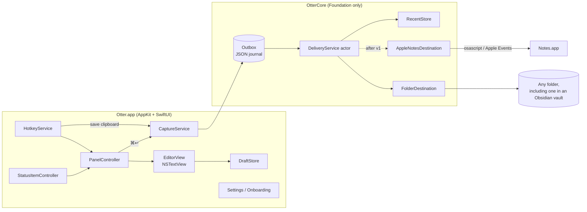
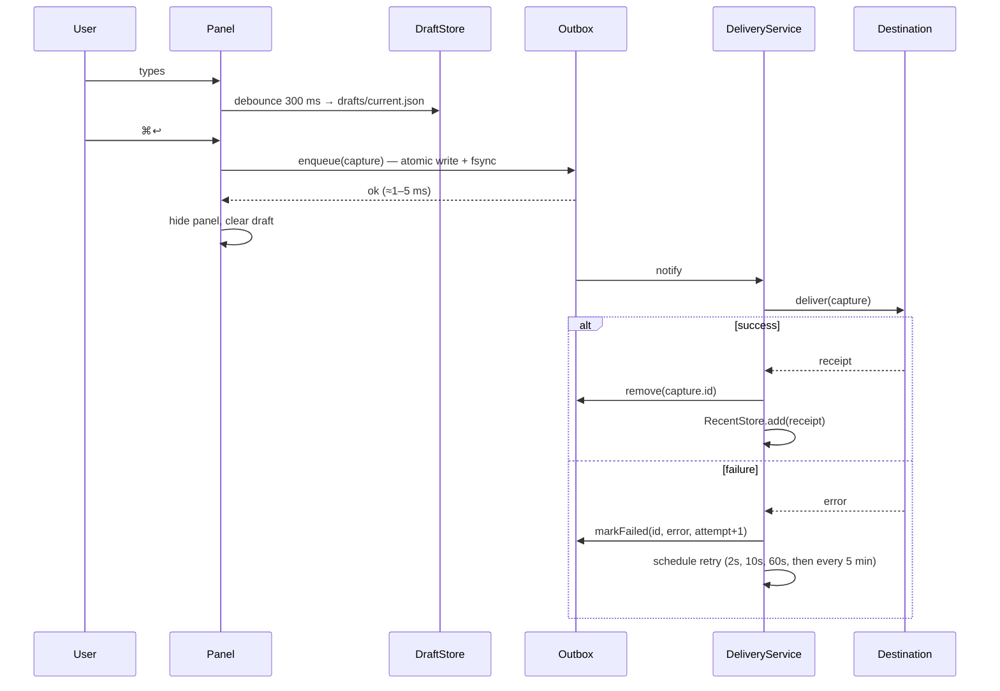

# Otter — Architecture

## 1. Shape of the system

One process. A native Swift menu-bar agent (`LSUIElement = YES`) with no server and no helper daemons. Its only network access is Sparkle's update check, which the user can turn off (ADR-009). Two modules:

- **OtterCore** (local Swift package, Foundation only, no AppKit/SwiftUI): models, outbox, delivery, Markdown/HTML formatting, destination writers, Obsidian config parsing. Fully unit-testable on the command line.
- **Otter** (app target, AppKit + SwiftUI): hotkeys, floating panel, editor, menu bar, settings, onboarding, HUD.



## 2. Source layout

```
Otter/
├── Otter.xcodeproj
├── App/
│   ├── OtterApp.swift            # @main, NSApplicationDelegateAdaptor
│   ├── AppDelegate.swift         # wiring, lifecycle
│   ├── Hotkeys/HotkeyService.swift, SpotlightShortcutProbe.swift
│   ├── Panel/CapturePanel.swift  # NSPanel subclass
│   ├── Panel/PanelController.swift, PanelContentView.swift   # show/hide/position; header, text area, footer (T03, T15)
│   ├── Panel/DestinationPill.swift   # header dot + name; a click opens the destination menu (⌘1…⌘9, "Change Folder…") (T10, T17)
│   ├── Panel/EditorView.swift    # NSTextView wrapper + key handling; caret, delete and copy around hidden markers (ADR-016); draws bullets and checkboxes, list keys (T18)
│   ├── Panel/MarkdownStyler.swift   # text storage delegate: MarkdownStyling spans and list items → display-only style, indent and hiding attributes (ADR-016, ADR-017)
│   ├── Panel/SaveAsPrompt.swift  # ⌘S: native Save panel, centred on the screen (T16)
│   ├── Panel/AttachmentChips.swift   # chips row above the footer: thumbnail or icon, name, size, ✕ (T09)
│   ├── Capture/CapturePipeline.swift, CaptureService.swift   # builds the pipeline; submit → outbox (T05)
│   │          ClipboardCapture.swift   # save-clipboard hotkey + menu item: pasteboard → staged files → outbox → HUD (T11)
│   ├── HUD/HUDController.swift   # click-through pill near the bottom of the pointer's screen (T11)
│   ├── MenuBar/StatusItemController.swift   # menu rebuilt on open (UX_SPEC §4): New Note, Save Clipboard, Recent ▸, waiting row, Settings…, Check for Updates…, Quit; amber badge (T12, T13)
│   │          DeliveryNotifier.swift   # one notification per failure burst, permission asked at the first failure (T12)
│   │          FolderChooser.swift   # folder picker for a destination: panel header (T17), Settings, onboarding (T10)
│   │          ObsidianLink+Open.swift   # open a note in Obsidian, or reveal it in Finder (T07)
│   ├── Settings/SettingsWindowController.swift   # NSWindow hosting the SwiftUI tabs, or onboarding on first run (T10)
│   │           SettingsModel.swift   # @Observable: AppSettings + DestinationRegistry + outbox status; changes apply live
│   │           GeneralSettingsView.swift, DestinationsSettingsView.swift, DestinationForm.swift, AdvancedSettingsView.swift
│   │           ShortcutViews.swift   # recorder warnings, ⌘Space handoff (shared with onboarding)
│   │           LogExport.swift   # Reveal Logs: this run's log lines to logs/ (OSLogStore)
│   │           LoginItem.swift   # launch at login: SMAppService.mainApp, registered only when the user chooses (T12)
│   ├── Updates/UpdateController.swift   # Sparkle 2: daily check, "Check for Updates…", gentle reminders; off in Debug builds (T13)
│   ├── Onboarding/OnboardingModel.swift, OnboardingView.swift   # first run: hotkey, destination, try it (T10)
│   └── Resources/Info.plist, Assets.xcassets
└── Packages/OtterCore/
    ├── Sources/OtterCore/
    │   ├── Model/Capture.swift, Attachment.swift, DestinationConfig.swift
    │   ├── Attachments/PasteRules.swift, AttachmentLimits.swift, AttachmentStager.swift   # what a paste becomes, limits + footer text, drafts/files/ (T09)
    │   ├── Pipeline/Outbox.swift, DeliveryService.swift, DeliveryClock.swift, RecentStore.swift, DraftStore.swift,
    │   │            CaptureFailure.swift, StorageLocations.swift,
    │   │            DeliveryAlert.swift, RecentMenu.swift   # §4 rule 5 threshold and texts; Recent item titles (T12)
    │   ├── Destinations/Destination.swift, DestinationRegistry.swift, AttachmentEmbed.swift
    │   │                DestinationStatus.swift   # health dot level, actionable problems + fixes, mode summary, Test (T10)
    │   ├── Destinations/Folder/FolderDestination.swift, MarkdownWriter.swift, FileNamer.swift,
│   │                       FolderBookmark.swift, FolderRegistration.swift   # builder, default inbox (T06)
    │   ├── Destinations/Obsidian/ObsidianVault.swift, ObsidianVaultSettings.swift,   # vault lookup, app.json (T07)
    │   │                         ObsidianAttachmentPlacement.swift, ObsidianLink.swift, VaultDiscovery.swift
    │   ├── Destinations/AppleNotes/AppleNotesDestination.swift, NotesHTML.swift, OsascriptRunner.swift   # after v1 (T08)
    │   ├── Editor/MarkdownFormatting.swift   # ⌘B/⌘I/⇧⌘X/⌘E/⌘K: Markdown markers to add or remove, as one edit
    │   │          MarkdownStyling.swift      # inline Markdown → spans: kind, content and marker ranges (UTF-16) (ADR-016)
    │   │          HiddenMarkerEditing.swift  # caret stops, deletions, typing over a selection, line-break splits, copied Markdown (ADR-016); list prefixes, ↩ continues lists (T18)
    │   │          MarkdownLists.swift        # `- ` / `- [ ]` items: prefix, level, checked; ⌘L, ⇧⌘8, Tab/⇧Tab, checkbox toggle edits (T18, ADR-017)
    │   ├── Panel/PanelPlacement.swift, PanelFrameStore.swift   # pure panel size/position maths; remembered size + per-display positions (T03, T15)
    │   ├── Clipboard/ClipboardSave.swift, HUDPlacement.swift   # what the clipboard holds, HUD messages, "Already saved" window, HUD frame (T11)
    │   ├── Hotkeys/HotkeyCombo.swift, SpotlightShortcutState.swift, EffectiveToggleHotkey.swift,
    │   │           PanelToggleAction.swift, ShortcutValidation.swift   # pure hotkey rules (T02)
    │   │           OnboardingHotkeyStatus.swift   # onboarding step 1: press to confirm, wait for Spotlight (T10)
    │   ├── Settings/AppSettings.swift   # UserDefaults-backed preferences, Reset all (T10)
    │   └── Support/Logging.swift     # Logger categories (§10), shared by app and core
    │               Signposts.swift   # os_signpost intervals (§9)
    └── Tests/OtterCoreTests/
├── scripts/release.sh, cask.sh   # signed + notarized DMG, appcast, release notes; Homebrew cask (T13, ADR-019)
├── .github/workflows/ci.yml, release.yml   # tests + build on every push; a `v*` tag publishes a release (T13)
├── CHANGELOG.md                  # one section per version: GitHub release notes and Sparkle's update notes
└── LICENSE                       # MIT
```

## 3. Core model

```swift
public struct Capture: Codable, Identifiable, Sendable {
    public let id: UUID
    public let createdAt: Date
    public let timeZoneIdentifier: String // TimeZone.current at capture time; delivery formats createdAt in it
    public var text: String
    public var title: String?           // set by ⌘S save-as (T16); nil = unnamed
    public var fileURL: URL?            // the file chosen in the ⌘S Save panel (T16); nil = destination names it
    public var attachments: [Attachment]
    public var destinationID: DestinationID
    public var source: Source           // .panel | .clipboard
}

public struct Attachment: Codable, Sendable {
    public let id: UUID
    public var originalName: String?    // nil for clipboard image data: saved as "Pasted image yyyyMMddHHmmss.<ext>"
    public var uti: String              // e.g. public.png
    public var relativePath: String     // "<id>.<ext>" inside drafts/files/, then outbox/<capture-id>/files/
    public var byteCount: Int
}

public protocol Destination: Sendable {
    var id: DestinationID { get }
    var displayName: String { get }
    var supportsAttachments: Bool { get }
    func healthCheck() async -> DestinationHealth          // .ok | .needsPermission | .unreachable(String)
    func deliver(_ capture: Capture, files: URL) async throws -> DeliveryReceipt
}

public struct DeliveryReceipt: Codable, Sendable {
    public var location: Location        // .file(URL) | .appleNote(id: String?)  (.appleNote is unused until T08)
    public var deliveredAt: Date
}
```

A note in an Obsidian vault is still `.file(URL)`. Whether it's in a vault is worked out when it's opened (§5.2), so a folder that later moves into or out of a vault still opens the right way.

`DestinationConfig` is a Codable struct: an `id`, a display `name`, and an `options` enum. v1 has only `.folder(FolderOptions)`: an Obsidian vault is a folder (ADR-013), and T08 adds `.appleNotes(NotesOptions)` after v1 (ADR-015). `DestinationRegistry` persists the list, in `⌘1…⌘9` order, and the default ID in `UserDefaults` as JSON. It builds each `Destination` through a factory where each kind registers a builder. Folder locations are stored as **bookmark data**, not paths, so moved/renamed folders keep working. A refreshed bookmark (the folder was renamed) is saved back to the registry. With nothing configured, the registry holds the default inbox, `~/Documents/Otter Inbox/`, which has no bookmark until the first save creates the folder.

## 4. The capture pipeline

The pipeline is the heart of the "instant and never lose anything" promise.



**Rules**

1. The panel hides only after the outbox write returns. That write is a small local file — single-digit milliseconds — so it never shows up as latency.
2. Delivery is **at-least-once**. A duplicate can only occur if the process dies between the destination write and the outbox removal; that window is tiny and a duplicate is far better than a loss (ADR-005).
3. `DeliveryService` is an actor with **one serial queue per destination**, so appends to the same file keep their order, and a slow Apple Notes call never blocks a folder write. A capture waiting on a retry holds back the later captures for its destination. Captures whose destination can't be built stay pending and are flagged in the service's status; there is no retry timer for them.
4. On launch, on wake from sleep (`NSWorkspace.didWakeNotification`) and on any successful enqueue, the service drains pending items. There are no polling timers while the outbox is empty.
5. After 5 consecutive failures for one destination: macOS notification + amber menu bar badge. Items are never auto-deleted. The count is the attempts of the destination's oldest pending capture, which holds back the rest of its lane; re-routing starts it again. The badge stays while any destination is over the threshold; the notification is posted once when a destination crosses it and removed once its captures are delivered or moved (`DeliveryStatus.alertingDestinations`, `DeliveryAlert`).
6. If a destination is deleted while items are pending for it, those items are offered for re-routing to the default destination (`Outbox.reroute`). Settings won't delete the last destination. "Retry now" makes every pending item due at once (`DeliveryService.retryNow`).

## 5. Destinations

### 5.1 Folder

- **Saved with `⌘S`** (T16, ADR-014): written to exactly the file chosen in the Save panel, in any folder and whatever the mode, replacing a file already there (the Save panel confirmed it). Atomic, like new files; a retry rewrites the same file.
- **New file per note**: `{yyyy-MM-dd HHmm} {title}.md`, where `title` = the first non-empty line, Markdown markers stripped, characters illegal in filenames or Obsidian links removed (`/ \ : * ? " < > | # ^ [ ]`), trimmed to 60 chars, fallback "Quick note". Collisions get ` 2`, ` 3`….
- **Append to file**: creates the file if missing; ensures a trailing newline; appends a block rendered from a template (default below), with one blank line between blocks. `{{time}}` is `HH:mm`.
- **Attachments** (T09): copied before the note is written, into `attachmentsFolder` (default `attachments`) relative to the note's folder, or inside a vault where `app.json` says (§5.2). A pasted image is named `Pasted image yyyyMMddHHmmss.<ext>` from the capture's time; a file keeps its name. A taken name gets ` 2`, ` 3`…, unless the file there has the same bytes: that's the copy a failed earlier attempt made, so a retry reuses it. The note links to them at the end, after a blank line, one per line: `` for images, `[spec.pdf](attachments/spec.pdf)` for other files. In append mode `{{attachments}}` places them; a template without it gets them after `{{text}}`.
- Optional YAML frontmatter on new files: `title` (double-quoted, named captures only), `created` (ISO 8601 with offset), `source: otter`.
- A folder that was deleted (including one sitting in the Trash, where its bookmark still resolves) is "Folder missing": captures stay in the outbox until it's recreated where it was or another folder is chosen. Only the default inbox is recreated automatically.
- **Writes are atomic for new files** (temp file in the same directory + rename) and **coordinated for appends** (`NSFileCoordinator` with `.forMerging`, then `FileHandle.seekToEnd()` + write + `synchronize()`), which keeps iCloud Drive and Obsidian's file watcher happy.

Default append template:

```
{{#single_line}}- {{time}} {{text}}{{/single_line}}
{{#multi_line}}
### {{time}}
{{text}}
{{/multi_line}}
```

Implemented as a tiny hand-rolled renderer (`{{time}}`, `{{date}}`, `{{text}}`, `{{title}}`, `{{attachments}}`, two conditional sections). No templating dependency.

### 5.2 Obsidian

There's no Obsidian destination: a vault is just a folder (ADR-002, ADR-013). A folder destination anywhere inside a vault picks up the vault's conventions, and each capture is still its own note in the folder the user chose. Daily notes aren't supported; T06's append mode covers one running file.

**Vault detection.** `ObsidianVault.containing(url)` walks up from the folder (itself included) to the first ancestor with a `.obsidian/` directory; with nested vaults the nearest wins, and a `.obsidian` *file* doesn't count. The lookup is a few `stat` calls and is never cached, so a folder moved into or out of a vault is followed.

| Need | Source of truth |
|---|---|
| List of vaults | `~/Library/Application Support/obsidian/obsidian.json` → `vaults{id: {path, ts}}` (`VaultDiscovery`, newest first, skipping missing paths and folders without `.obsidian/`) |
| Attachment folder | `<vault>/.obsidian/app.json` → `attachmentFolderPath` (`/` = vault root, `./` = same folder as note, `./sub` = subfolder of note's folder, otherwise a vault-relative path; `..` and absolute paths fall back to the root). Overrides `FolderOptions.attachmentsFolder` inside a vault. |
| Link style | `<vault>/.obsidian/app.json` → `useMarkdownLinks` (`![[x.png]]` vs ``) and `newLinkFormat` (`shortest`, `relative`, `absolute`) |

`app.json` is read at each delivery (it's tiny), so changes made in Obsidian apply without a relaunch. Missing or malformed files, and keys of the wrong type, fall back to Obsidian's defaults: attachments at the vault root, wikilinks, `shortest`. `ObsidianAttachmentPlacement` turns these into the directory to copy into and the embed text, which `FolderDestination` uses for every attachment of a note in a vault (T09). Markdown links are relative to the note and percent-encoded. A file name with `# ^ [ ] |` can't be a wikilink target, so it gets a Markdown link even in a wikilink vault. Otter never writes inside `.obsidian/`.

Obsidian does **not** need to be running. "Open in Obsidian" (`ObsidianLink.open`, used by T12's Recent menu) checks at open time whether the note is in a vault and something handles `obsidian://`, then opens `obsidian://open?vault=<name>&file=<vault-relative path without .md>`, with both values percent-encoded except `A–Z a–z 0–9 - . _ ~`. Otherwise it reveals the file in Finder.

### 5.3 Apple Notes (after v1)

Not in v1 (ADR-015). This is the design T08 builds in M3.

- Executed out-of-process via `/usr/bin/osascript` (`Process`) on a background queue. Reasons: `NSAppleScript` is not safe off the main thread and Notes calls can block for seconds; a child process is attributed to Otter for TCC, so the prompt reads "Otter wants to control Notes".
- **Note text is never interpolated into script source.** The script is a constant passed on stdin; values go in as `argv` (`on run argv`). This removes any script-injection risk from pasted content.
- Body is HTML: escape `& < > "`, one `<div>` per line, empty lines as `<div><br></div>`. Notes uses the first line as the title.
- Folder is created on first use if missing.
- Error `-1743` (not authorized) → `DestinationHealth.needsPermission` with a deep link to System Settings › Privacy & Security › Automation.
- Timeout 20 s per call (Notes may need to launch and sync).

## 6. Panel mechanics

The panel is an `NSPanel` subclass configured to behave like Spotlight:

```swift
styleMask: [.nonactivatingPanel, .titled, .fullSizeContentView, .resizable]
titleVisibility = .hidden; titlebarAppearsTransparent = true
standardWindowButton(.closeButton/.miniaturizeButton/.zoomButton)?.isHidden = true
level = .floating
collectionBehavior = [.canJoinAllSpaces, .fullScreenAuxiliary, .ignoresCycle]
hidesOnDeactivate = false; isReleasedWhenClosed = false
isMovableByWindowBackground = true
override var canBecomeKey: Bool { true }
```

Because it is **non-activating**, showing it does not activate Otter — the previously frontmost app stays active, and when the panel hides, keyboard focus returns to it with no `NSApp.activate`/`hide` dance. The panel is created once at launch and only ordered in/out, so showing it costs a single `makeKeyAndOrderFront`.

The panel is a sticky note, not a bar (ADR-012): it opens at a user-resizable size (default 380 × 300 pt) and doesn't auto-grow. Its size (`panelSize`) and its position per display (`panelPositions`, keyed by display UUID, stored as an offset from that display's `visibleFrame`) live in `UserDefaults`, are cached in memory, and are clamped on-screen at every show (T15). Only drags of the header or footer move it; the text view returns `mouseDownCanMoveWindow = false`. Settings and onboarding are ordinary windows that *do* activate the app.

## 7. Permissions

| Permission | When it's requested | Required for | Failure handling |
|---|---|---|---|
| None for the hotkey | — | Carbon `RegisterEventHotKey` (via the KeyboardShortcuts package) needs no Accessibility permission | — |
| Files & Folders (Documents, Desktop, iCloud Drive) | First write to a protected location; triggered during onboarding/Test | Folder & Obsidian destinations in protected locations | Health check → "Grant access" button re-opens folder picker |
| Automation → Notes (after v1, T08) | First Apple Notes call; triggered by onboarding/Test | Apple Notes destination | `-1743` → guided fix |
| Notifications | First delivery failure | Failure alerts | Badge-only if denied |

Info.plist includes `NSAppleEventsUsageDescription` already, so T08 doesn't need an Info.plist change.

## 8. Storage

All under `~/Library/Application Support/Otter/`:

```
drafts/current.json          # text + attachment refs of the in-progress note
drafts/files/                # its attachments, as <attachment-id>.<ext>, until submitted (T09)
outbox/<capture-id>.json     # pending capture + delivery attempts + last error
outbox/<capture-id>/files/   # attachment payloads until delivered
recent.json                  # last 20 receipts (first line, destination, location, time) — opt-out
logs/                        # os.Logger is primary; Settings › Advanced › Reveal Logs exports this run's lines here
```

Settings in `UserDefaults` (domain `io.github.elizabeth-ling.otter`), including Sparkle's `SU…` keys. Nothing is stored anywhere else.

## 9. Performance budget

| Path | Budget | How |
|---|---|---|
| Cold launch → hotkey ready | < 300 ms | No work at launch besides panel creation + hotkey registration; outbox drain deferred 1 s |
| Hotkey → panel visible + key | < 50 ms target, 100 ms p95 | Pre-built panel, no SwiftUI view rebuild on show, draft read cached in memory |
| Keystroke latency | Native `NSTextView`; inline restyle < 1 ms for a 10 KB note | No per-keystroke work besides debounced draft save and inline styling: the whole note is parsed, only lines whose spans changed are re-attributed (ADR-016) |
| `⌘↩` → panel hidden | < 50 ms | Outbox write only; formatting happens in delivery |
| Idle | 0% CPU, < 40 MB | No timers when outbox empty; release attachment thumbnails on hide |

Instrument with `os_signpost` intervals: `hotkey→visible`, `submit→hidden`, `enqueue→delivered` (per destination), `restyle` (per edit). T14 verifies.

## 10. Error handling and logging

- `os.Logger(subsystem: "io.github.elizabeth-ling.otter", category: …)` with categories `app` (menu bar, notifications, login item), `hotkey`, `panel`, `pipeline`, `folder`, `obsidian`, `notes`.
- **Never log note contents.** Log capture IDs, byte counts, destination IDs, and error codes only.
- User-facing errors are short, specific and actionable ("Can't write to ‘Vault/Daily’ — folder is missing. Choose it again…").

## 11. Testing strategy

- **OtterCore unit tests** (fast, run in CI): Markdown formatting, inline styling, list items and hidden-marker editing rules, file naming, title sanitizing, template rendering, Moment→DateFormatter translation, Obsidian config parsing against fixture vaults, attachment-path resolution, Notes HTML escaping (T08), outbox crash-recovery (enqueue → simulate crash → reload → deliver), retry scheduling with a `FakeDestination`.
- **Integration tests** (local only): Folder/Obsidian destinations against temp directories; Apple Notes (T08, after v1) behind an env flag because it needs TCC.
- **Manual test matrix** (T14): Spaces, full-screen apps, Stage Manager, multiple displays, IME input, Dark/Light, accessibility settings, iCloud Drive vaults.

## 12. Dependencies

Keep this list short on purpose.

| Package | Why | Task |
|---|---|---|
| [sindresorhus/KeyboardShortcuts](https://github.com/sindresorhus/KeyboardShortcuts) | Global hotkeys + recorder UI, no Accessibility permission | T02 |
| [Sparkle 2](https://github.com/sparkle-project/Sparkle) | Auto-updates outside the App Store | T13 |

Everything else (YAML frontmatter, templates, Moment format translation, HTML escaping) is small enough to hand-write and test.
