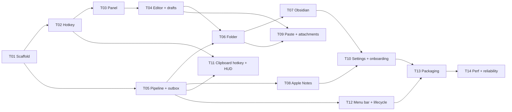

# Build Plan

Each task is sized to be one focused PR (roughly half a day to a day and a half). Each file is self-contained enough to hand to a coding agent or pick up cold: goal, required reading, scope, implementation notes, acceptance criteria, and what's explicitly out of scope.

## Milestones

| Milestone | Done when | Tasks |
|---|---|---|
| **M0 — Walking skeleton** | You can press the hotkey (`⌘Space`, or `⌥Space` while Spotlight still owns it) anywhere, type, hit `⌘↩`, and the note lands in a folder you chose. Point it at your Obsidian vault and start dogfooding. | T01 → T02 → T03 → T04 → T05 → T06 |
| **M1 — Integrations** | Obsidian daily-note append, Apple Notes, pasted images, save-clipboard hotkey | T07, T08, T09, T11 |
| **M2 — Ship it** | A stranger can download a notarized DMG, onboard in under a minute, and auto-update | T10, T12, T13, T14 |

## Dependency graph



Parallelizable: after T05, **T08** (Apple Notes) can be built alongside T06/T07. **T11** can start as soon as T02 + T05 are in.

## Task file format

```
# Txx — Title
Milestone · Depends on · Estimate
## Goal                 — one paragraph, the outcome
## Read first           — which docs/sections matter
## Scope                — what to build
## Implementation notes — the non-obvious parts, decisions already made
## Acceptance criteria  — checkboxes; the PR is done when all are ticked
## Out of scope         — so the task doesn't sprawl
```

## Definition of done (every task)

- [ ] Acceptance criteria all met and demonstrated (short screen recording for UI tasks).
- [ ] OtterCore logic has unit tests; `xcodebuild test` is green in CI.
- [ ] No note contents in logs.
- [ ] No new third-party dependency without a new ADR.
- [ ] If the implementation contradicts a doc, the doc is updated in the same PR.

## Handing a task to a coding agent

Something like:

> Read `context/docs/OVERVIEW.md`, `context/docs/ARCHITECTURE.md` and `context/docs/DECISIONS.md`, then implement `context/tasks/T06-folder-destination.md`. Follow the task's implementation notes and stay within its scope. Before finishing, check every acceptance criterion and list how each was verified.
